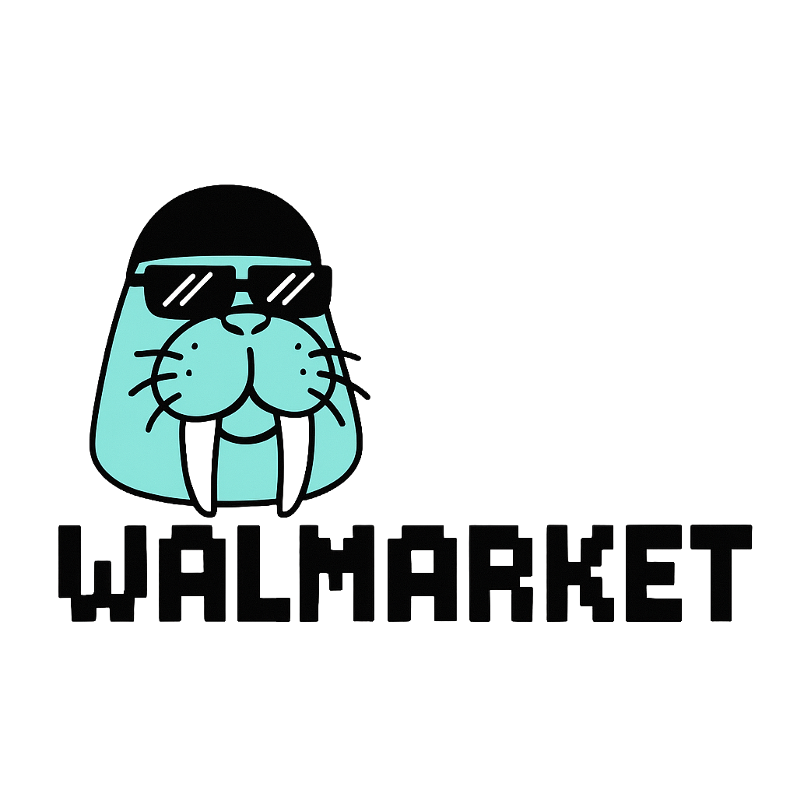
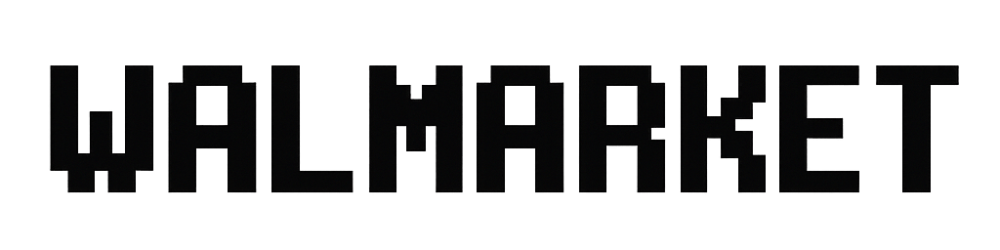

# 🔮 Walmarket - Decentralized Truth Through Markets

<div align="center">
  

  <p><strong>AI-Powered Prediction Markets on SUI</strong></p>
  <p>A truth engine powered by Walrus - predict, verify, and earn on decentralized prediction markets</p>

  [](https://walmarket.fun)
  [](https://youtu.be/dQw4w9WgXcQ)
  [](LICENSE)
</div>

---

## 📺 Demo Video

[](https://youtu.be/dQw4w9WgXcQ)

> **Click to watch the full demo** - See Walmarket in action!

---

## 🏆 Walrus Haulout Hackathon 2025

**Track:** Provably Authentic (Truth Engine + Trust Oracle)

**Problem Statement:**

Traditional AI oracles suffer from a critical trust problem: users must blindly trust that operators run AI models honestly and report results accurately. There's no way to verify:
- Which AI model was actually used
- What input data was fed to the model
- Whether the output was tampered with
- If the reasoning stored matches what was claimed

**Our Solution:**

Walmarket eliminates oracle trust requirements through **verifiable AI execution**:

1. **Nautilus TEE** - AI inference runs in secure enclaves with cryptographic attestation proving execution integrity
2. **GPT-5 Single Model Policy** - Consistent, reproducible results with fixed prompts and schemas
3. **Walrus Evidence Storage** - Complete audit trail (input, output, reasoning) stored immutably
4. **SUI On-Chain Verification** - Smart contracts validate TEE signatures, enclave registry, and blob hashes
5. **Economic Security** - Stake, slash, and challenge mechanisms ensure honest reporting

**Result:** The world's first prediction market oracle where AI execution is cryptographically proven, not trusted.

---

## 🎯 Overview

Walmarket is the **world's first verifiable AI oracle** for prediction markets, combining Nautilus TEE, GPT-5, and SUI blockchain to create trustless, cryptographically-proven market resolution. Built for the Walrus Haulout Hackathon 2025 (Provably Authentic track), Walmarket eliminates the need to trust oracle operators by running AI inference inside secure enclaves with remote attestation.

### Why Walmarket?

- **🔐 Nautilus TEE Integration**: AI inference runs in secure enclaves with cryptographic attestation, proving execution integrity
- **🤖 Verifiable AI Oracle**: GPT-5 predictions verified through TEE signatures, enclave registry, and on-chain validation
- **📊 Immutable Evidence Storage**: Complete audit trail (input, output, reasoning) stored permanently on Walrus
- **⚡ On-Chain Verification**: SUI smart contracts validate TEE attestation, aggregate reports, and enforce slashing
- **💰 Trustless Resolution**: No operator trust required - cryptographic proofs guarantee honest execution
- **🎨 Retro Gaming Aesthetics**: Unique pixel art design inspired by Walrus branding

---

## ✨ Core Features

### 1. Verifiable AI Oracle with Nautilus TEE
- **Trusted Execution Environment**: GPT-5 inference runs inside Nautilus secure enclaves
- **Remote Attestation**: Each report includes enclave signature (mrenclave) proving execution integrity
- **Multi-Source Verification**: AI agents cross-reference multiple trusted data sources
- **Evidence Bundle Storage**: Complete input/output/reasoning stored on Walrus with blob hash verification
- **On-Chain Validation**: SUI smart contracts verify TEE signatures against enclave registry whitelist
- **Replay Protection**: Timestamps and nonces prevent report replay attacks

### 2. USDT-Based Prediction Markets
- Create custom prediction markets on any real-world event
- **USDT Trading**: All markets use USDT stablecoin (6 decimals) for predictable value
- Binary outcome markets (YES/NO) with transparent odds
- Market categories: Crypto, Technology, DeFi, Politics, Infrastructure
- Real-time odds based on collective wisdom and pool ratios
- Volume tracking and participant statistics
- **Walrus Metadata**: Market details stored immutably on Walrus for auditability

### 3. Wallet Integration
- **Supported Wallets**:
  - Sui Wallet
  - Suiet Wallet
  - Ethos Wallet
  - Slush Wallet
  - Morphis Wallet
  - Glass Wallet
  - All wallets compatible with @mysten/dapp-kit
- One-click connection
- Secure transaction signing
- Address display with truncation
- Automatic wallet detection

### 4. Walrus Storage Integration
- **Market Metadata Storage**: Full market details (descriptions, images, sources) stored on Walrus
  - `walrus_metadata_blob_id` stored on-chain for each market
  - Rich metadata beyond on-chain storage limits
  - Immutable market documentation
- **Oracle Evidence Bundle**: Complete AI oracle reports stored on Walrus
  - Input data and sources used for resolution
  - GPT-5 reasoning and analysis
  - TEE attestation and cryptographic proofs
  - `oracle_evidence_blob_id` anchored on-chain
- **Blob Hash Verification**: On-chain contracts verify blob hashes against Walrus storage
- **Immutable Audit Trail**: Permanent, tamper-proof record of all oracle decisions
- **Post-Hoc Verification**: Anyone can audit oracle behavior by fetching evidence bundles from Walrus

**Example Walrus Usage:**
```typescript
// Market Creation
1. Upload metadata JSON to Walrus → get blob_id
2. Call create_market(title, description, category, end_date, blob_id)
3. Market stores blob_id on-chain, anyone can fetch full metadata

// Oracle Resolution
1. AI generates evidence bundle with reasoning + sources
2. Upload evidence to Walrus → get blob_id
3. Call resolve_market(outcome, evidence_blob_id)
4. Anyone can verify AI decision by fetching blob from Walrus
```

### 5. User Experience
- Responsive design (desktop & mobile)
- Pixel art retro gaming aesthetics
- Press Start 2P font for authentic 8-bit feel
- Intuitive betting interface
- Real-time market statistics

---

## 🔄 User Flow

```
1. Connect Wallet → 2. Browse Markets → 3. Compare Odds
   ↓
4. Place Bet → 5. Market Resolution (TEE Oracle)
   ↓
6. On-Chain Verification → 7. Walrus Evidence Storage → 8. Claim Winnings
```

### Detailed Flow

1. **Connect Wallet**: Users connect their SUI-compatible wallet (Phantom, Sui Wallet, etc.)
2. **Browse Markets**: Explore prediction markets across various categories
3. **Compare Odds**: View crowd-determined YES/NO probabilities
4. **Place Bet**: Choose YES or NO, enter USDT amount, and confirm transaction on SUI
5. **Market Resolution**:
   - Off-chain: Nautilus TEE executes GPT-5 inference with multi-source data
   - Evidence bundle (input, output, reasoning) uploaded to Walrus
   - TEE generates cryptographic signature and attestation
6. **On-Chain Verification**:
   - SUI smart contract validates enclave signature against registry whitelist
   - Blob hash verified against Walrus anchor
   - Multiple reporter submissions aggregated (median)
7. **Walrus Evidence Storage**: Complete audit trail permanently stored with blob_id
8. **Claim Winnings**: Winners receive earnings based on verified market outcome

---

## 🛠️ Tech Stack

### Frontend
- **Framework**: Next.js 16 (App Router)
- **UI Library**: React 19
- **Language**: TypeScript
- **Styling**: Tailwind CSS 4
- **Font**: Press Start 2P (Google Fonts)

### Blockchain
- **Network**: SUI
- **SDK**: @mysten/dapp-kit, @mysten/sui
- **Wallet Integration**: Multiple wallet support via dapp-kit
- **State Management**: TanStack Query (React Query)

### Infrastructure
- **Storage**: Walrus (for verifiable data storage)
- **AI Oracle**: GPT-5 with custom verification agents
- **TEE**: Nautilus (Trusted Execution Environment for verifiable AI execution)
- **Deployment**: Vercel (frontend), SUI Testnet/Mainnet

---

## 🧪 Test Token Information (SUI Testnet)

The following test USDT tokens have been deployed and minted for testing:

### Contract Addresses
- **Package ID**: `0x6e930c6b39d8a77e4e755148564207a801d0a2f550ec306fee7b9b913ed6f17d`
- **Treasury Cap ID**: `0x014367974122be63c27c5ec3a51c0e92e7e34bbb8a48fc99c48c444505e677bf`
- **Market Registry ID**: `0xec89a1e95991bb73e1e521540036d8ffc3eb5892a4629e616873d4586a00c4df`
- **USDT Token Type**: `0x6e930c6b39d8a77e4e755148564207a801d0a2f550ec306fee7b9b913ed6f17d::usdt::USDT`
- **Suiscan Explorer**: [View USDT Token on Suiscan](https://suiscan.xyz/testnet/coin/0x6e930c6b39d8a77e4e755148564207a801d0a2f550ec306fee7b9b913ed6f17d::usdt::USDT/txs)

### Initial Minting
- **Amount**: 1,000,000 USDT (1M USDT)
- **Transaction**: `Bb6mFoKgF3k7EaGWdyN3w2pjHbtUmfvUCQ2TECjKLv3C`
- **Deployment Transaction**: `GsWUUvApRzra1khb4PcZP7MNxwzCvgvYqB6STFyAf7y4`

### Mint Additional Tokens
```bash
cd contracts
export PACKAGE_ID=0x6e930c6b39d8a77e4e755148564207a801d0a2f550ec306fee7b9b913ed6f17d
./scripts/mint_usdt.sh 0x014367974122be63c27c5ec3a51c0e92e7e34bbb8a48fc99c48c444505e677bf 1000000000 $(sui client active-address)
```

---

## 🚀 Installation & Setup

### Prerequisites
- Node.js 18+ and npm
- Git
- A SUI-compatible wallet (Phantom, Sui Wallet, etc.)

### Clone Repository
```bash
git clone https://github.com/leopard627/walmarket.git
cd walmarket
```

### Install Dependencies
```bash
npm install
```

### Environment Setup
Create a `.env.local` file in the root directory:
```env
# SUI Network Configuration
NEXT_PUBLIC_SUI_NETWORK=testnet

# Optional: Add your custom RPC endpoints
NEXT_PUBLIC_SUI_RPC_URL=https://fullnode.testnet.sui.io:443
```

### Run Development Server
```bash
npm run dev
```

Visit [http://localhost:3000](http://localhost:3000) to see the app.

### Build for Production
```bash
npm run build
npm start
```

---

## 🔧 Smart Contracts

Walmarket includes SUI Move smart contracts for on-chain prediction markets.

### Build Contracts
```bash
cd contracts
sui move build
```

### Test Contracts
```bash
cd contracts
sui move test
```

### Deploy to Testnet
```bash
cd contracts
sui client publish --gas-budget 100000000
```

📚 **For detailed contract documentation, see [contracts/README.md](./contracts/README.md)**

---

## 🪝 Git Hooks

This project uses [Husky](https://typicode.github.io/husky/) to ensure code quality before commits and pushes.

### Pre-commit Hook
Automatically runs before each commit:
- **Lint check**: Validates code style with ESLint

### Pre-push Hook
Automatically runs before pushing to remote:
- **Frontend build test**: Ensures `npm run build` succeeds
- **Contract build test**: Validates SUI Move contracts (if `sui` CLI is installed)

This prevents broken code from being pushed to the repository, ensuring main branch stability.

---

## 📁 Project Structure

```
walmarket/
├── app/
│   ├── components/
│   │   ├── Header.tsx             # Shared header with TESTNET badge
│   │   └── WalletButton.tsx       # Wallet connection component
│   ├── markets/
│   │   ├── page.tsx               # Markets list page
│   │   └── [id]/
│   │       └── page.tsx           # Market detail page
│   ├── layout.tsx                 # Root layout with providers
│   ├── page.tsx                   # Landing page
│   ├── providers.tsx              # SUI & wallet providers
│   └── globals.css                # Global styles + pixel font
├── contracts/
│   ├── sources/
│   │   ├── market.move            # USDT-based prediction market contract
│   │   └── usdt.move              # Test USDT token contract (6 decimals)
│   ├── scripts/
│   │   └── mint_usdt.sh           # Script to mint test USDT
│   ├── tests/                     # Contract tests
│   ├── Move.toml                  # Move package configuration
│   └── README.md                  # Contract documentation
├── public/
│   ├── icon-txt.png               # Walrus character + logo
│   └── no-bg-txt.png              # Text-only logo
├── package.json
├── next.config.ts
├── tailwind.config.ts
└── tsconfig.json
```

### Key Files

#### Frontend
- **`app/providers.tsx`**: Sets up SUI client and wallet providers
- **`app/components/Header.tsx`**: Shared header component with TESTNET badge
- **`app/components/WalletButton.tsx`**: Handles wallet connection UI
- **`app/markets/page.tsx`**: Displays all available prediction markets with AI predictions
- **`app/markets/[id]/page.tsx`**: Detailed market view with betting interface and AI analysis
- **`app/globals.css`**: Global styles including Press Start 2P pixel font configuration

#### Smart Contracts
- **`contracts/sources/market.move`**: USDT-based prediction market contract with Walrus integration
  - Market creation with Walrus metadata blob ID
  - USDT betting with pool-based odds
  - Oracle resolution with Walrus evidence blob ID
  - Winnings distribution and position tracking
- **`contracts/sources/usdt.move`**: Test USDT token (6 decimals) for prediction markets
- **`contracts/scripts/mint_usdt.sh`**: Helper script to mint test USDT tokens
- **`contracts/Move.toml`**: SUI Move package configuration
- **`contracts/README.md`**: Comprehensive contract documentation and API reference

---

## 💡 How It Works

### AI Oracle Architecture with Trusted Data Sources

1. **Data Collection**: AI agents monitor multiple trusted data sources
   - **Crypto Markets**: CoinMarketCap, CoinGecko, Coinbase, Binance APIs
   - **Traditional Finance**: Bloomberg, Reuters, Yahoo Finance
   - **Sports**: ESPN, Official League APIs
   - **Politics**: AP News, Reuters, Fox News, Official Government Sources
2. **Multi-Source Verification**: Cross-reference data from at least 3 independent sources
3. **TEE Execution**: Run GPT-5 inference inside Nautilus secure enclave
4. **Cryptographic Attestation**: Generate TEE signature and remote attestation proof
5. **Walrus Storage**: Store evidence bundle (input, output, reasoning) permanently on Walrus
6. **On-Chain Verification**: SUI smart contract verifies TEE attestation and blob hash
7. **Market Resolution**: Aggregate verified reports and distribute winnings

### Verifiable AI Execution with Nautilus TEE

- **Execution Integrity**: AI inference runs in secure enclaves, preventing operator tampering
- **Remote Attestation**: Each report includes cryptographic proof of execution (mrenclave, signatures)
- **Enclave Registry**: On-chain whitelist of authorized enclaves with epoch-based key rotation
- **Replay Protection**: Timestamps and nonces prevent report replay attacks
- **Hash Verification**: Input/output hashes link on-chain reports to off-chain evidence on Walrus

**Example Oracle Evidence Bundle (stored on Walrus):**
```json
{
  "market_id": "0xabc123...",
  "question": "Will BTC reach $100,000 by Dec 2025?",
  "outcome": "YES",
  "resolution_date": "2025-12-31T23:59:59Z",
  "sources": [
    {
      "name": "CoinMarketCap",
      "url": "https://coinmarketcap.com/currencies/bitcoin/",
      "timestamp": "2025-12-31T20:00:00Z",
      "btc_price": "$102,450"
    },
    {
      "name": "CoinGecko",
      "url": "https://coingecko.com/en/coins/bitcoin",
      "timestamp": "2025-12-31T20:01:00Z",
      "btc_price": "$102,380"
    },
    {
      "name": "Binance",
      "url": "https://api.binance.com/api/v3/ticker/price?symbol=BTCUSDT",
      "timestamp": "2025-12-31T20:02:00Z",
      "btc_price": "$102,420"
    }
  ],
  "reasoning": "Based on 3 independent sources (CoinMarketCap, CoinGecko, Binance), Bitcoin's price was confirmed above $100,000 on December 31, 2025. Average price: $102,416. All sources agree the threshold was exceeded.",
  "tee_attestation": {
    "mrenclave": "0xdef456...",
    "signature": "0x789abc...",
    "timestamp": "2025-12-31T20:05:00Z"
  }
}
```

---

## 🎮 Usage Guide

### For Traders

1. **Connect Your Wallet** - Click "Connect Wallet" and select your preferred wallet
2. **Browse Markets** - View all available markets with live odds and AI predictions
3. **Analyze Market** - Review AI prediction, confidence level, and reasoning
4. **Place Your Bet** - Select YES or NO, enter amount, and confirm
5. **Track Positions** - Monitor market status and claim winnings after resolution

---

## 🔗 Links

- **Live Demo**: [https://walmarket.fun](https://walmarket.fun)
- **Demo Video**: [https://youtu.be/dQw4w9WgXcQ](https://youtu.be/dQw4w9WgXcQ)
- **GitHub**: [https://github.com/leopard627/walmarket](https://github.com/leopard627/walmarket)
- **SUI Network**: [https://sui.io](https://sui.io)
- **Walrus**: [https://www.walrus.xyz](https://www.walrus.xyz)

---

## 🏗️ Roadmap

### Phase 1: MVP (✅ Current)
- ✅ Frontend implementation
- ✅ Wallet integration
- ✅ AI prediction display
- ✅ Market browsing and detail pages

### Phase 2: Smart Contracts (🔄 In Progress)
- 🔄 SUI Move smart contracts for markets
- 🔄 Automated market maker (AMM) logic
- 🔄 AI oracle integration on-chain
- 🔄 Wallet transaction implementation

### Phase 3: AI Oracle (📋 Planned)
- 📋 Multi-source data fetching
- 📋 Consensus algorithm
- 📋 Cryptographic proof generation
- 📋 Walrus storage integration

### Phase 4: Advanced Features (📋 Future)
- 📋 Market creation UI
- 📋 Liquidity pools
- 📋 Trading history & Leaderboards
- 📋 Mobile app

---

## 🤝 Contributing

We welcome contributions! Please follow these steps:

1. Fork the repository
2. Create a feature branch (`git checkout -b feature/amazing-feature`)
3. Commit your changes (`git commit -m 'Add amazing feature'`)
4. Push to the branch (`git push origin feature/amazing-feature`)
5. Open a Pull Request

---

## 📄 License

This project is licensed under the MIT License - see the [LICENSE](LICENSE) file for details.

---

## 🙏 Acknowledgments

- **Walrus Haulout Hackathon** for the inspiration and prizes
- **SUI Foundation** for the amazing infrastructure
- **Walrus Team** for decentralized storage solutions
- **Mysten Labs** for the excellent dapp-kit
- **Press Start 2P Font** for the retro aesthetics

---

## 📞 Contact

- **GitHub**: [@leopard627](https://github.com/leopard627)
- **Project Link**: [https://github.com/leopard627/walmarket](https://github.com/leopard627/walmarket)

---

<div align="center">
  <p>Built with ❤️ for Walrus Haulout Hackathon 2025</p>
  <p>Creating Unstoppable Truth Infrastructure</p>
  
</div>
